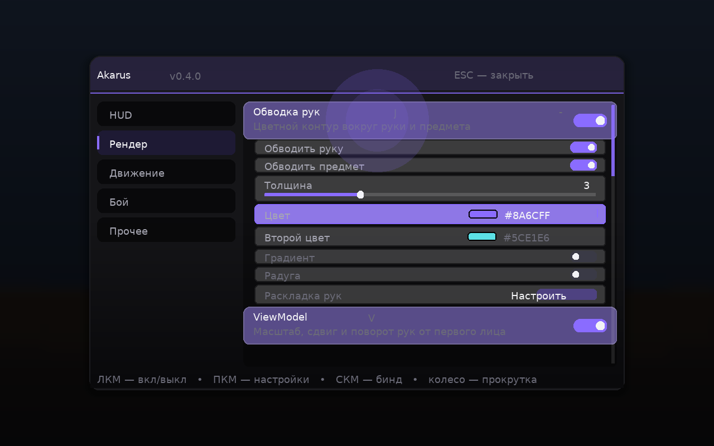
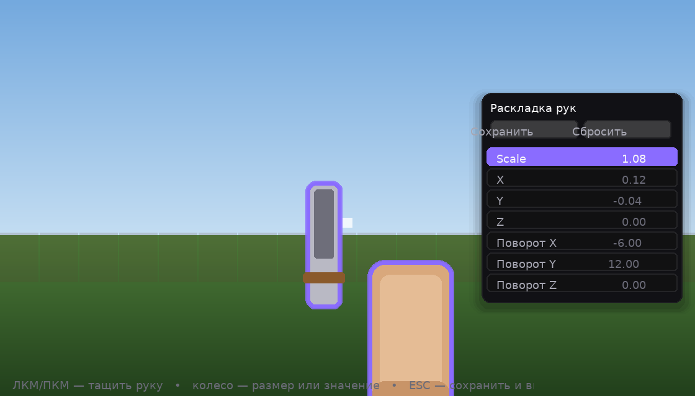

# Akarus

Каркас клиентского мода (мод-клиента) **Akarus** для **Minecraft 26.2** на **Fabric**.

- **ClickGUI** — собственное меню в чёрных тонах: размытый фон, мягкая многослойная тень,
  «волна» в месте клика, плавные анимации, категории, тумблеры, слайдеры, переключатели
  режимов, текстовые поля, **цвета в HEX** и **кнопки-действия**. Никакого «пиксельного»
  рисования: скругления считаются построчно с частичным покрытием пикселей, поэтому край
  гладкий, а текст нигде не выходит за рамки — все подписи режутся по ширине с «…»;
- **система модулей** — включение/выключение, **свои бинды прям из меню**, настройки
  семи типов (включая режимы), сохранение в JSON;
- **модули**: HUD-инфо, **FreeCam** (настоящая свободная камера: игрок стоит, летает только
  вид — так это работает на серверах), **AutoMine** (добыча через Baritone),
  **AutoWalk** (смотришь на блок → ПКМ → Baritone сам идёт туда),
  **Обводка рук** (цветной контур и мягкое свечение руки и предмета от первого лица) и
  **ViewModel** (масштаб, сдвиг и поворот рук от первого лица + редактор раскладки).


Вкладка «Рендер» с настройками обводки рук (цвета, градиент и кнопка редактора раскладки):



Редактор раскладки рук поверх игрового мира — руку видно сразу, всё меняется на лету:



HUD в игре выглядит так:


> Мокапы выше сгенерированы скриптом `tools/preview_render.py` — он повторяет геометрию и цвета
> кода, но рисует их через Pillow, поэтому это «примерная» картинка, а не скриншот из игры.

## Где взять готовый jar

1. **GitHub Actions (рекомендуется, если локально нет JDK 25 или нет доступа к Gradle):**
   готовый jar лежит в [Releases](https://github.com/inkvizrebirth/Akarus/releases) —
   например [Akarus v0.5.0](https://github.com/inkvizrebirth/Akarus/releases/tag/v0.5.0),
   файл `akarus-0.5.0.jar`.
   Либо: вкладка **Actions** → workflow **build** → **Run workflow** → после завершения
   скачать артефакт `akarus` из секции Artifacts (там же всегда лежит `akarus-build-log` с логом сборки).
2. **Локально:**

```bash
./gradlew build          # собрать мод, jar появится в build/libs/
./gradlew runClient      # запустить игру с модом из папки run/
```

Готовый jar кладём в папку `mods` клиента с Fabric Loader 0.19.3 и Fabric API.

## Требования

| Что | Версия |
| --- | --- |
| Minecraft (Java Edition) | 26.2 |
| Fabric Loader | 0.19.3 |
| Fabric API | 0.158.0+26.2 |
| JDK | **25** (иначе будет ошибка `release version 25 not supported`) |
| Gradle | 9.5.1 (через `gradlew`) |

JDK 25: [Adoptium Temurin 25](https://adoptium.net/temurin/releases/?version=25).
Первый запуск сборки скачивает Minecraft, маппинги и Fabric API — нужен интернет.

## Модули

| Модуль | Категория | Клавиша | Что делает |
| --- | --- | --- | --- |
| **HUD-инфо** | HUD | `H` | FPS, координаты, направление, пинг, водяной знак, список активных модулей |
| **FreeCam** | Движение | `N` | Настоящая свободная камера: игрок стоит на месте и молчит в сеть, летает только вид |
| **FreeLook** | Движение | `K` | Камера от третьего лица: мышью облетает игрока (он всегда в центре), игрок играет как обычно — Baritone не мешает |
| **AutoMine** | Прочее | `B` | Автоматическая добыча блоков через Baritone: **что** и **сколько**, режимы **Нормальный** и **Легитный** (`#legitmine` + человечные повороты) |
| **AutoWalk** | Движение | `G` | Осмотр фрикамом → **ПКМ** по блоку, на который смотришь → Baritone ведёт туда |
| **KillAura** | Бой | `X` | Автоматическая атака: режимы **Быстрый** и **Легитный** (человечные довороты), приоритет цели, дальность, фильтры игроков/мобов/невидимых |
| **Обводка рук** | Рендер | `J` | Контур и свечение вокруг руки и предмета от первого лица: стиль, толщина в пикселях, мягкость, цвета, градиент, радуга, плотность |
| **ViewModel** | Рендер | `V` | Масштаб, сдвиг и поворот рук от первого лица; раскладка правится в редакторе (включён по умолчанию) |

### Обводка рук

Руки от первого лица в 26.2 рисуются в собственный submit-контейнер, диспетчер которого ванильную
фазу `outline` не исполняет вовсе — то есть штатного канала обводки у них нет. Модуль делает обводку
сам, и делает это **без масштабирования модели** (именно «раздувание» руки масштабом выглядело как
баг: масштаб считается от начала системы координат, а оно у руки — в углу экрана, поэтому копия
уезжала в сторону; плюс копия лежала на той же глубине и закрашивала руку целиком).

Вместо масштаба рука и предмет рисуются несколько раз со сдвигом **в плоскости экрана**: 12 копий по
кругу, каждая смещена на «толщину» в пикселях и одновременно уходит на доли блока от камеры, поэтому
там, где рука есть, она перекрывает копию по глубине, а наружу торчит ровно ровное кольцо. Толщина
пересчитывается из пикселей в единицы камеры по высоте окна и hud-fov (он в 26.2 для рук постоянный —
70°), поэтому «3 пикселя» остаются тремя пикселями на любом масштабе руки и любом разрешении.
Цвет — у вершин, через emissive-пайплайн, поэтому он ровно тот, что выбран в меню, и не светится/не
темнеет вместе с рукой.

Настройки — каждая реально на что-то влияет:

- **Обводить руку** / **Обводить предмет** — включить контур по отдельности для руки и для предмета;
- **Стиль** — `Контур` (плотное кольцо), `Свечение` (мягкий ореол, чуть подкрашивает и саму руку —
  то, что обычно называют «шейдером») или `Контур + свечение` (по умолчанию);
- **Толщина (px)** — 1…12, ширина плотного кольца в пикселях;
- **Мягкость (px)** — 0…12, насколько широко растекается свечение; 0 — только плотное кольцо;
- **Цвет** и **Второй цвет** — HEX прямо в меню (плашка, код, мигающий курсор);
- **Градиент** — переход от основного цвета ко второму **поперёк кольца**, а не по анимации замаха;
- **Радуга** + **Скорость радуги** — оттенок бежит по кругу обводки и со временем;
- **Плотность, %** — альфа обводки (на 100% цвет ровно такой, как выбран);
- **Раскладка рук → Настроить** — открывает редактор раскладки (см. ниже).

### ViewModel и редактор раскладки

Миксин перехватывает позу руки (`ItemInHandRenderer#renderArmWithItem`) до того, как игра положит в
стек матриц собственный взмах, и накладывает сверху масштаб, сдвиг и поворот. Два момента,
из-за которых раньше «изменение рук вообще не работало»:

1. масштаб и поворот применяются **вокруг запястья** (той же точки-якоря `0.56 / -0.52 / -0.72`,
   вокруг которой ваниль подвешивает руку), а не от начала координат — иначе рука улетает за край
   экрана, и выглядит это как «ничего не происходит, только перетаскивание живое»;
2. раскладка применяется, пока модуль включён, а модуль **включён по умолчанию**; редактор раскладки
   сам включает его, если ты меняешь значения при выключенном модуле.

Модуль действует на обе руки сразу; сдвиг по X для второй руки отзеркаливается (как в ванили) —
это настройка **«Зеркалить левую руку»**. Раскладка хранится отдельно, в `config/akarus_viewmodel.json`,
чтобы править её часто и не смешивать с настройками модулей.

Редактор (`Раскладка рук → Настроить` в настройках модулей «Обводка рук» и «ViewModel»):

- рука остаётся на экране — все изменения видно сразу;
- **ЛКМ/ПКМ и потянуть** — двигать руку;
- **колесо над рукой** — размер (Масштаб);
- **колесо над списком** — значение выбранного параметра;
- **↑ / ↓** — шаг по одному значению, **Ctrl+↑/↓** — по пять (доводить руками удобнее так);
- **клик по строке** — выбрать параметр (Масштаб / Сдвиг X/Y/Z / Поворот X/Y/Z);
- **Сохранить** и **Сбросить** — сверху;
- **ESC** — сохранить и вернуться в ClickGUI.


### FreeCam

Настоящая свободная камера — «глаз отдельно от тела», а не полёт игрока.

Прежняя версия выдавала игроку режим полёта и `noPhysics`, то есть тело физически летело сквозь
блоки. На сервере так не делают: античит снимает это за пару секунд, а сервер откатывает позицию
телепортом. Здесь игрока не трогаем вообще — меняем только позицию камеры:

- `CameraMixin` перехватывает конец `Camera#alignWithEntity` и ставит камере нашу точку. Игра после
  этого сама честно считает фрустум отсечения, звук и перспективу — с нашей точки, поэтому чанки не
  «исчезают», а мир не рвётся;
- `KeyboardInputMixin` обнуляет уже посчитанный игрой ввод (`keyPresses`, `moveVector`): игрок стоит,
  не спринтит, не топочет ногами и не шлёт лишние пакеты состояния, а клавиши при этом остаются
  «нажатыми» для модуля — камера летит, пока кнопка держится;
- поворот — настоящий, игровой: мышь крутит голову игрока, поэтому направление взгляда совпадает у
  камеры, у прицела и у того, что видит сервер. Ни одного пакета, в котором клиент врёт, не уходит.

Движение: **WASD** — горизонталь, **Пробел/Shift** — вверх/вниз, **Ctrl** — ускорение.

- **Скорость** (1–20) — 0.12 блока за тик на единицу (на скорости 6 это ~14 блоков в секунду);
- **Ctrl — ускорение ×2** — множитель, пока зажат Ctrl;
- **Не давать игроку ходить** — выключить заморозку ввода (игрок сможет идти пешком за камерой);
- **Гасить ЛКМ/ПКМ** — по умолчанию включено: прицел во время полёта показывает не то, что увидит
  игрок (он стоит далеко от камеры), так что клик сломал бы блок у ног. Взаимодействие с миром
  во время фрикам-полёта всё равно осталось бы на стороне игрока, и сервер бы его отклонил;
- **Показывать координаты камеры** — плашка снизу: XYZ камеры и расстояние до игрока;
- выключение (та же клавиша или ESC-выход из мира) возвращает камеру игроку — мгновенно и без рывков.

### FreeLook

Камера от третьего лица, которая вращается мышью вокруг игрока — игрок всегда в центре экрана.

Отличие от FreeCam: FreeCam уводит «глаз» и гасит клики, а FreeLook остаётся приклеенной к
игроку и ничего в игре не меняет. Можно копать, драться и пользоваться Baritone: мышью во время
FreeLook крутится только камера, а поворот игрока не трогается вообще (его выставляет Baritone,
когда ведёт путь или добывает блоки — конфликта нет).

- `MouseHandlerMixin` после `MouseHandler#turnPlayer` смотрит, на сколько мышь повернула игрока,
  откатывает игроку его поворот и отдаёт дельту камере — чувствительность ровно игровая, и ни один
  пакет не меняется;
- `CameraMixin` ставит камере наши углы и позицию перед игроком; по пути камера «ужимается» перед
  плотными блоками, как ванильный вид от третьего лица;
- `Camera#isDetached` на время FreeLook возвращает «отцеплена» — игра рисует тело игрока и прячет
  руку от первого лица.

Настройки: **Дистанция, блоков** (1–8, по умолчанию 4). FreeCam важнее: если включены оба, летит
именно FreeCam. Выключение (`K`) мгновенно возвращает обычный вид.

### AutoMine (Baritone)

Для работы нужен установленный **Baritone** (Fabric, версия для Minecraft 26.2, например
[baritone v1.19.0](https://github.com/cabaletta/baritone/releases) — файл `baritone-api-fabric-1.19.0.jar`
или `baritone-standalone-fabric-1.19.0.jar`).

Настройки модуля:

- **Режим** — **Нормальный** или **Легитный**:
  - *Нормальный* — как раньше: API или `#mine 16 diamond_ore`, повороты мгновенные;
  - *Легитный* — Baritone получает `#legitmine 16 diamond_ore` и копает «как игрок», а довороты
    к блокам очеловечивает `RotationHumanizer` (общий слой с киллаурой): Baritone по умолчанию
    поворачивается к блоку мгновенно и точно в центр — вместо этого камера доворачивается плавно,
    с индивидуальным «промахом» до пары градусов (не в центр!), переменной скоростью от ленивых
    ~10°/тик до резких ~48°/тик и «дышащим» шагом. Обычная мышь при этом не трогается;
- **Блок** — что добывать, например `diamond_ore`, `ancient_debris`, `oak_log`;
- **Сколько** — сколько предметов получить (`0` — без ограничения);
- **Рандомизация, %** (0–100, по умолчанию 80) — степень «человечности» доворотов в легитном
  режиме: промахи, перелёты с коррекцией, дрожь и задержки. 0 — плавно, но прицельно;
- **Командами чата** — использовать чат-команды Baritone (`#mine 16 diamond_ore`) вместо API.
  Полезно, если API не ответил; при выключении модуля отправляется `#stop` (тоже через API, а если
  он молчит — чатом). В легитном режиме команда идёт всегда — `#legitmine` существует только как
  чат-команда.

Интеграция сделана через reflection (`BaritoneAPI → getProvider → getPrimaryBaritone → getMineProcess →
mineByName`), поэтому Akarus собирается и работает **без** Baritone — просто AutoMine при включении
скажет, что Baritone не найден, и выключится.

Baritone ищется по наличию класса `baritone.api.BaritoneAPI`, а не по `isModLoaded("baritone")`: мод
ставят и как библиотеку, и в составе других клиентов, и имя мода тогда не совпадает. Методы
берутся из **публичных интерфейсов** `baritone.api.*` (реализации в Baritone package-private — обычный
`obj.getClass().getMethod(...)` их находит, но вызвать не даёт `IllegalAccessException`). Если
рефлексивный путь не сработал — автоматически отправляется чат-команда (`#mine 16 diamond_ore`).

### AutoWalk (Baritone)

Сценарий: **включил → посмотрел → ПКМ → пришёл**.

1. Включаешь модуль (`G` по умолчанию) — включается **FreeCam**, чтобы можно было отойти и осмотреться.
   Игрок при этом стоит там же, где стоял.
2. Снизу по центру экрана панель: `Смотрю на: X Y Z` и подсказка `ПКМ — идти сюда`.
3. Наводишь прицел на место, куда хочешь попасть, и жмёшь **правую кнопку мыши**. Цель выбирается
   лучом из камеры (а не из глаз игрока — игрок-то стоит далеко, и `Minecraft#hitResult` показал бы
   совсем другой блок): шаг 0.25 блока до первого непрозрачного блока, а если ни во что не попал —
   вниз от камеры, «в землю».
   ПКМ перехватывается в начале тика и гасится для игры, поэтому блоки не ломаются и не ставятся.
4. Фрикам выключается, Baritone получает цель — `GoalGetToBlock` через `ICustomGoalProcess#setGoalAndPath`
   (в старых версиях API — `setGoal` + `path`), а если API не ответил — чат-команду `#goto x y z`.
   Панель переключается в режим `Цель: X Y Z` и показывает, сколько метров осталось.
5. ПКМ во время пути — отменяет маршрут и возвращает в режим осмотра.
6. Дошёл — модуль выключается сам. Если путь оборвался (блок недоступен, мешали) — об этом пишет
   чат, и модуль возвращается к выбору точки, а не висит включённым «в никуда».

Настройки модуля:

- **Дальность выбора, блоков** (16–256) — как далеко от камеры луч ищет блок, на который смотрим;
- **Осматриваться фрикамом** — включать FreeCam на время выбора точки;
- **Командами чата** — всегда работать через чат (`#goto`, `#stop`) вместо API;
- **Выключиться по приходу** — снимать модуль, когда цель достигнута.

Раньше модуль «не работал, хотя Baritone установлен» по четырём причинам: проверка `isModLoaded("baritone")`
не видела Baritone, поставленный библиотекой; `getMethod` по классу реализации падал на
`IllegalAccessException` (методы объявлены в публичных интерфейсах); запасной чат-путь использовал
команду `#goal`, которой в Baritone нет (правильно — `#goto x y z`); и, главное, цель бралась из
позиции игрока, которая у фрикам-полёта часто оказывалась внутри блока — путь не строился никогда.
Всё это исправлено: Baritone ищется по классу, методы берутся из интерфейсов, цель — из-под прицела
камеры, команда чата — `#goto`.

Как и AutoMine, модуль требует установленный Baritone; без него он вежливо отключается и пишет об этом в чат.

### KillAura

Автоматическая атака целей вокруг игрока. Категория **Бой**, включается `X`.

- **Режим**:
  - *Быстрый* — доворот мгновенный и точный, удар сразу, как только восстановилась сила удара;
  - *Легитный* — повороты проходят через `RotationHumanizer` (тот же слой, что и в легитном
    AutoMine). На **каждую новую цель** разыгрывается заново весь «захват», поэтому паттернов,
    которые можно поймать логами, нет: случайный промах (не в центр, и свой на каждую цель),
    один из трёх профилей скорости («снайпер» 34–50°/шаг, «обычный» 16–36, «ленивый» 8–18),
    перелёт с короткой коррекцией, плавное торможение у цели, дрожь прицела и его «дыхание»
    на достигнутой цели, задержка реакции 30–170 мс, «спотыкания» руки и плавающий ритм шагов.
    Удар — только прицелом, который «успел» за целью (перелёт скорректирован, до 6° до точки),
    с человеческой паузой при смене цели; тайминг ударов диктует восстановление силы, поверх
    него — мелкий шум и изредка «задумался»;
- **Дальность, блоков** (1–6, по умолчанию 4) — дальность считается от игрока до цели;
- **Приоритет цели** — *Ближний*, *Слабый (мало HP)* или *Под прицелом* (у кого меньше угол
  до текущего взгляда);
- **Игроки** / **Враждебные мобы** — кого вообще считать целью (мирная живность не трогается);
- **Невидимые** — атаковать ли невидимых (по умолчанию нет);
- **Через стены** — бить ли без прямой видимости (по умолчанию нет: требуется линия взгляда);
- **Рандомизация, %** (0–100, по умолчанию 70) — компромисс «человечность ↔ буст»: масштабирует
  промахи, перелёты, дрожь, задержки реакции и ритм. 0 — довороты остаются плавными (никаких
  телепортов углов), но прицельными и быстрыми — максимум пользы в PvP; 100 — весь шум на полную.
  Точка прицеливания тоже выбирается заново на каждую цель: преимущественно корпус, примерно
  каждый пятый раз — голова.

Удар всегда ждёт восстановления силы атаки (`getAttackStrengthScale ≥ 0.93`) — спам ослабленными
ударами и урон меньше, и выглядит ботом. В меню, чате и во время еды/натягивания лука киллаура
приостанавливается.

## Управление

| Действие | Клавиша |
| --- | --- |
| Открыть меню клиента | **Правый Shift** |
| HUD-инфо | **H** |
| FreeCam | **N** (движение камеры — WASD, вверх/вниз — Пробел/Shift, Ctrl — ускорение) |
| FreeLook | **K** (мышью крути камеру вокруг игрока, игрок всегда в центре) |
| AutoMine | **B** |
| AutoWalk | **G** |
| KillAura | **X** |
| Обводка рук | **J** |
| ViewModel | **V** |
| В меню: переключить модуль | ЛКМ по строке |
| В меню: редактировать цвет | ЛКМ по строке цвета, печатать HEX, Enter/ESC — снять фокус |
| В меню: кнопка-действие (например «Настроить») | ЛКМ по строке с кнопкой |
| В редакторе раскладки: двигать руку | ЛКМ/ПКМ и потянуть |
| В редакторе раскладки: размер / значение | колесо мыши |
| В меню: открыть настройки модуля | ПКМ по строке |
| В меню: назначить бинд | **СКМ (колесико) по строке**, затем нажать нужную клавишу (ESC — отмена) |
| В меню: слайдер | тянуть ЛКМ |
| В меню: текстовое поле | ЛКМ — фокус, печатать, Enter/ESC — снять фокус |
| В меню: прокрутка списка | колесо мыши |
| В меню: переключить режим (строка «Стиль») | ЛКМ по сегменту; если сегменты не влезают — по левой/правой половине строки |
| В меню: переместить окно | перетаскивание за шапку |

Все бинды меняются прямо в ClickGUI: **нажми колесиком мыши по модулю**, затем нажми любую
клавишу (или кнопку мыши) — она станет новым биндом. Текущий бинд написан серым рядом с названием
модуля; `ESC` отменяет назначение. Бинды сохраняются в `config/akarus.json` и при этом
обновляются в стандартных настройках управления Minecraft (категория **«Akarus»**).

## Что где лежит

```
src/main/java/com/akarus/client/
├── AkarusClient.java             — точка входа, регистрация всего, клавиша меню
├── baritone/BaritoneBridge.java  — мост к Baritone (reflection + чат-команды)
├── config/ConfigManager.java     — сохранение настроек в config/akarus.json
├── gui/
│   ├── ClickGuiScreen.java       — окно ClickGUI (категории, модули, настройки, цвета, кнопки)
│   ├── HandEditorScreen.java     — редактор раскладки рук поверх мира
│   └── hud/HudRenderer.java      — отрисовка HUD через Fabric HUD API
├── mixin/
│   ├── AvatarRendererMixin.java  — обводка руки (повторный рендер контуром)
│   ├── CameraMixin.java         — позиция камеры для FreeCam
│   ├── KeyboardInputMixin.java  — заморозка ввода игрока во время FreeCam
│   ├── ItemInHandRendererMixin.java — раскладка рук (сдвиг/поворот/масштаб матрицы)
│   └── SubmitNodeCollectionMixin.java — обводка предмета
├── module/
│   ├── Module.java               — базовый класс модуля
│   ├── ModuleCategory.java       — категории (вкладки) модулей
│   ├── ModuleManager.java        — реестр модулей, обработка клавиш и тиков
│   └── impl/                     — модули: HudInfo, FreeCam, AutoMine, AutoWalk,
│                                   HandShader, ViewModel
├── render/
│   ├── HandOutlineRenderer.java  — обводка: кольца-копии руки/предмета со сдвигом по экрану
│   └── HandRenderHook.java       — мост между миксинами и модулями
├── settings/                     — настройки: булевы, числа, режимы (ModeSetting), строки,
│                                   **цвета (HEX)**, **кнопки**
├── viewmodel/
│   ├── ViewModelConfig.java      — сохранение раскладки в config/akarus_viewmodel.json
│   └── ViewModelProfile.java     — scale, offsetX/Y/Z, rotationX/Y/Z + change(…)
└── util/RenderUtils.java         — скруглённые прямоугольники, тень, градиенты, волна
```

## Как добавить свой модуль

1. Создаём класс-наследник `Module` в `module/impl`:

```java
public class ZoomModule extends Module {
    private final IntSetting fov = intSetting("fov", "Сила приближения", 30, 5, 90);
    private final StringSetting mode = textSetting("mode", "Режим", "smooth");

    public ZoomModule() {
        super("zoom", "Зум", "Приближает обзор", ModuleCategory.RENDER, GLFW.GLFW_KEY_Z);
    }

    @Override
    public void tick() {
        // логика модуля, пока он включён
    }

    @Override
    public void onSettingsChanged() {
        // вызывается после изменения любой настройки в меню
    }
}
```

2. Регистрируем его в `ModuleManager.init()`:

```java
register(new HudInfoModule());
register(new FreeCamModule());
register(new AutoMineModule());
register(new AutoWalkModule());
register(new HandShaderModule());
register(new ViewModelModule());
register(new ZoomModule());
```

Всё: модуль появится в меню, получит свою клавишу, настройки и запишется в конфиг.

## Ветвление и релизы

Основная (и единственная постоянная) ветка — **`main`**: в неё мёржатся все правки, от неё идёт
сборка и публикация релизов (`release.yml` реагирует на тег `v*`). Служебные ветки вида
`arena/<hash>-akarus`, из которых работают агенты, после мержа удаляются и копить их не надо:

```bash
git push origin --delete arena/<hash>-akarus
```

## Планы на ближайшие шаги

- выбор блока для AutoMine списком (а не строкой) и подсказки при вводе;
- бинды-комбинации (Ctrl+клавиша) и сброс бинда на стандартный;
- перетаскивание и масштабирование элементов HUD мышью;
- темы оформления и свои цвета акцента;
- новые модули (рендер, бой).

## Полезные ссылки

- [Fabric для Minecraft 26.2](https://fabricmc.net/2026/06/15/262.html) — что изменилось в API;
- [Fabric Docs](https://docs.fabricmc.net/develop) — официальная документация;
- [Пример мода от Fabric](https://github.com/FabricMC/fabric-example-mod) — основа `build.gradle`;
- [Baritone](https://github.com/cabaletta/baritone) — путь и автодобыча.

## Лицензия

CC0 1.0 Universal — делайте с кодом что угодно.
