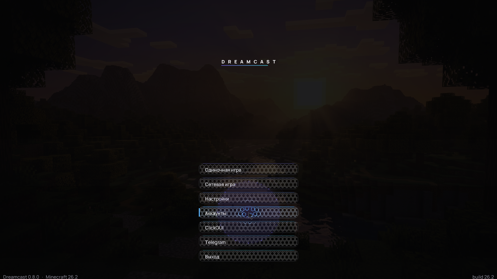
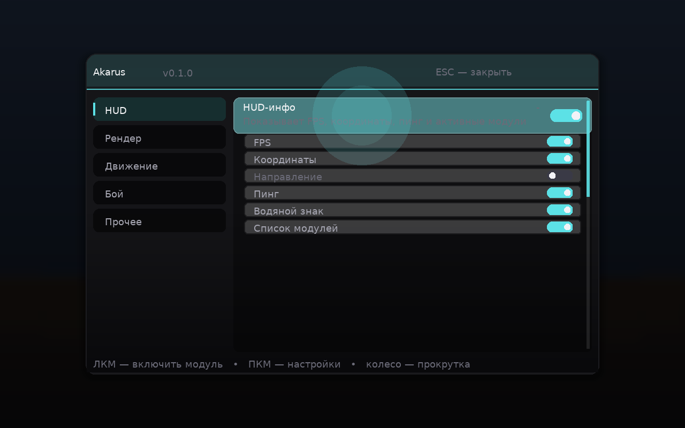
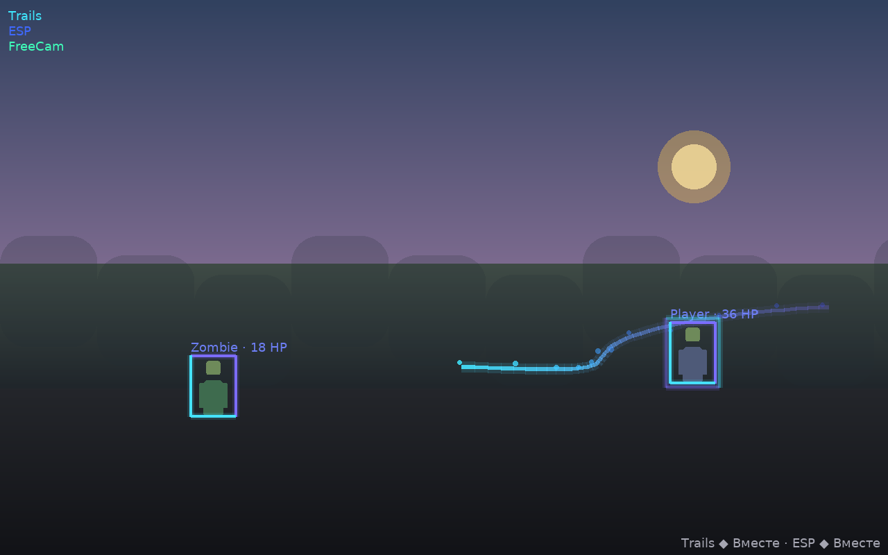
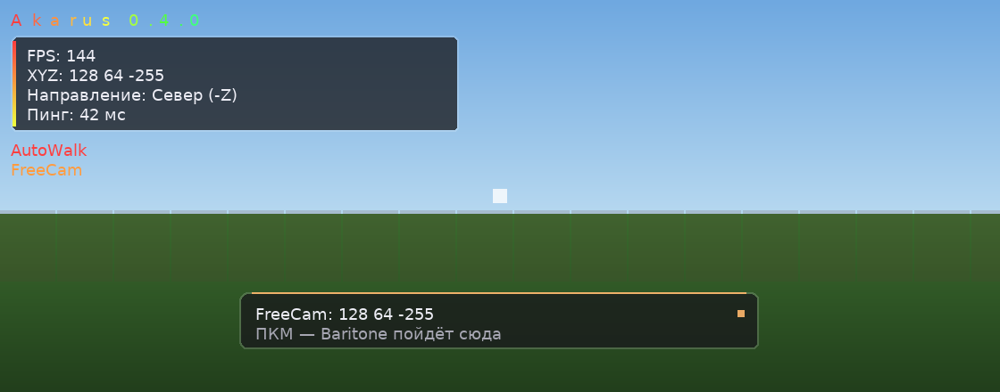
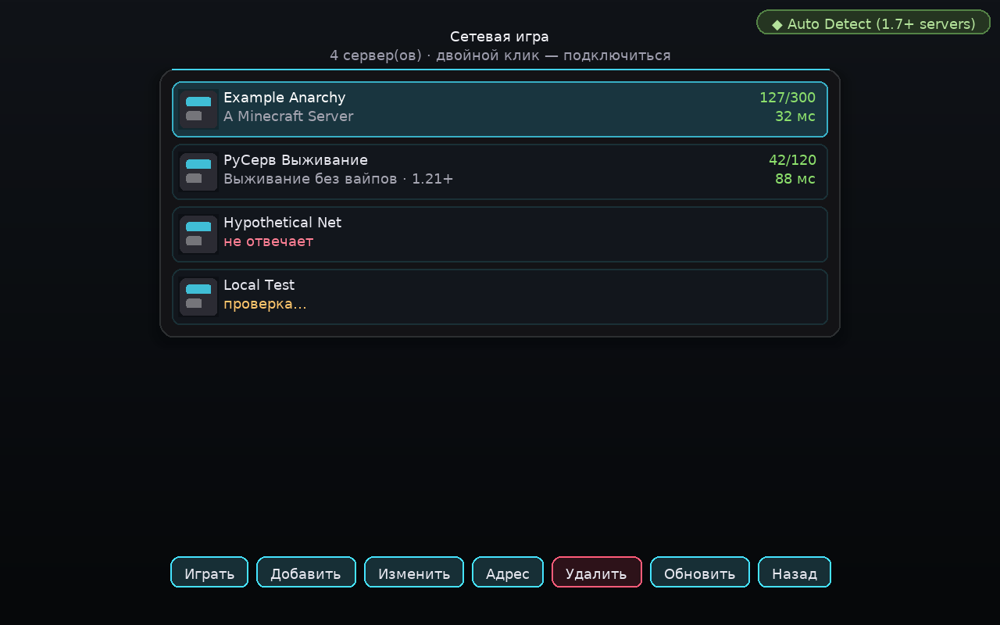
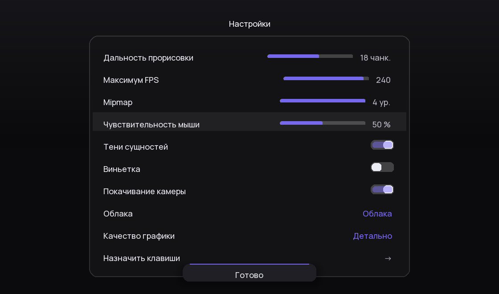

# Dreamcast DLC

**Клиентский мод Minecraft в чёрных тонах — GUI, HUD и модули целиком свои**

## Что это

Dreamcast DLC — клиентский мод на **Fabric для Minecraft 26.2** (Java 25). Он заменяет
собой оболочку игры: **главное меню, меню паузы, настройки, списки миров и серверов —
полностью свои**, в чёрной плавной стилистике «стекла» с фиолетово-циановым акцентом,
как и ClickGUI с HUD. Внутри — набор игровых модулей (включая Trails и ESP),
музыкальный плеер и встроенный **ViaFabricPlus** для подключения к серверам других
версий.

## Модули

| Модуль | Бинд | Что делает |
|---|---|---|
| **Trails** | — | Светящийся след за игроком: лента в мире (толщина, длина, градиент/радуга) и/или цветные партиклы |
| **ESP** | — | Подсветка сущностей: Glow (ванильное свечение своим цветом), Box (3D-бокс с градиентом по высоте или «только углы»), режим **TargetESP** (только текущая цель KillAura + полоска её здоровья), фильтры целей и радиус |
| **AutoTotem** | `R` | Тотем в левой руке **до** удара: предсказывает молаут-смэш сверху, трезубцы/стрелы и сближение мили. Легит/обычный/турбо, окно и радиус настраиваются |
| **KillAura** | `X` | RayTrace-обязательный, Авто-Блок щитом, Смарт-крит, сброс спринта + лимиты: не бить во время еды/тотема, только с оружием, не под водой, не в прыжке, отступление при малом HP |
| NoFallDamage | — | Мгновенное ведро воды в ноги при опасном падении |
| FreeCam / FreeLook | `N` | Полёт камеры без движения игрока / осмотр вокруг себя |
| AutoWalk | ПКМ | Baritone идёт на блок, на который смотришь |
| AutoMine | `B` | Автосбор урожая / добыча через Baritone |
| Sprint, NoFOV, NoBlind | — | Постоянный бег, фикс FOV, слепота выключена |
| Hand Shader / ViewModel | `V` | Цветная обводка руки с градиентом, сдвиг и масштаб рук |
| **MediaPlayer** | — | Фоновая музыка (wav) мимо звука игры: свой плеер, карточка на HUD с прогрессом и эквалайзером, кнопка «открыть папку с музыкой» в ClickGUI |
| **HUD** | `H` | Без выключателя — только список элементов: ватермарк, инфопанель, список модулей, **бинды** (белый/зелёный по статусу), медиаплеер, **уведомления**. Клавиша открывает редактор раскладки; элементы можно тащить и с открытым чатом |
| **ClickGUI** | `RShift` | Модуль-настройка меню: бинд открытия, «стекло» (полупрозрачное окно с блюром мира за ним), градиентные темы с переливом и своими цветами |
| **Nametags** | — | Таблички игроков с выбором содержимого: предмет в руке, пинг, броня, активные эффекты (с римскими уровнями), здоровье; дистанция настраивается |
| **NoSlow** (+NoWeb) | — | Убирает замедление: фильтры по предметам (меч, щит, еда, лук, дротик, паутина), режимы Vanilla/Packet/Grim/Strict, форс-множитель |
| **AutoBuff** | — | Авто-зелья в бою: режимы **fast** (мгновенно) и **legit** (человечные задержки и честная смена зелья в хотбаре), приоритеты Сила/Лечение/Скорость/Огнестойкость, золотые яблоки |
| **Макросы** | — | До 10 команд, каждой — свой бинд; мгновенная отправка, анти-спам при зажатии; свой экран редактора |
| **HitSounds** | — | Звук удара: pling/bell/bass/amethyst/orb, рост тона на добивании, «только по игрокам» |
| **HitParticles** | — | Эффект удара: режим **«Волна»** — фирменное светящееся кольцо точно в точке удара (как у Jump Effect), или искры |

## Не ванильный интерфейс

- **Главное меню** — шейдерный фон с медленным дрейфом, логотип Dreamcast, свои кнопки.
- **Список миров** — свой экран вместо SelectWorldScreen: иконки миров, дата, теги
  «эксперимент/другая версия», чипы Играть/Создать/Изменить/Удалить с инлайн-подтверждением.
- **Список серверов** — свой экран вместо JoinMultiplayerScreen: пинги, MOTD, игроки
  онлайн, иконки, добавление/редактирование/быстрый вход.
- **Меню паузы** — своё чёрное «стекло» вместо PauseScreen.
- **Настройки** — свой экран вместо ванильных: прорисовка, FPS, mipmap, мышь, облака,
  пресеты графики; назначение клавиш — нативный экран.
- **Версия протокола** — пилюля «◆ версия» в правом верхнем углу списка серверов:
  переключает протокол через **вшитый ViaFabricPlus** (включая «Автоопределение» для
  1.7+ серверов), с поиском по списку версий.
- **Alt Manager** — экран «Аккаунты» в главном меню: текущий аккаунт, добавление/вход/
  мгновенный случайный ник/удаление. После кика с сервера — свой экран отключения с
  кнопками «Переподключиться» и «Переподключиться с новым ником».
- **Гекс-кнопки** — все кнопки меню и чипы списков покрыты сотовой текстурой:
  шестиугольники расступаются у курсора и наливаются акцентом.
- **Клик-волна** — детализированная волна (ореол, мерцающее кольцо, эхо) в любой точке
  клика во всех экранах клиента и поверх ClickGUI.
- **Вшитые моды** — Sodium, Lithium, ImmediatelyFast и Mod Menu уже внутри jar
  (ставить отдельно не нужно); в настройках есть кнопки «Графика (Sodium)» и «Моды».
- **ClickGUI** (правый Shift) — 500×310, вкладки категорий с глифами, поиск по модулям,
  иконки у каждого модуля, стрелки раскрытия списков, темы с плавным переливом градиента,
  режим «стекла» с размытием мира за окном, анимации открытия/закрытия/нажатий, ripple-эффекты.
- **Свой шрифт** — весь интерфейс клиента набран Manrope (OFL), недостающие символы
  берутся из ванильного пиксельного.

## Музыка

Мод ищет треки в `<папка игры>/dreamcast/media`. Форматы: wav/aiff/au (PCM, без внешних
библиотек — играет системный `javax.sound`, не зависит от FPS и звука игры).
Кнопка **«Открыть папку с музыкой»** есть прямо в модуле MediaPlayer в ClickGUI.

## Установка

1. Поставь [Fabric Loader](https://fabricmc.net/use/installer/) для **Minecraft 26.2** и [Fabric API](https://modrinth.com/mod/fabric-api) (0.159+ для 26.2) — оба jar'а в `.minecraft/mods`.
2. Скачай `akarus-0.8.0.jar` из [releases](https://github.com/inkvizrebirth/Akarus/releases) и положи туда же.
3. ViaFabricPlus **уже встроен** (nested jar) — отдельной установкой можно не заморачиваться.

Сборка из исходников: `JAVA_HOME=jdk25 ./gradlew build` (CI дополнительно скачивает VFP
в `libs/` перед сборкой; без него мод собирается без виа внутри).

## Как это устроено

Клиентская точка входа (`"client"` в fabric.mod.json), 11 миксинов без refmap'а
(Minecraft 26.2 использует имена Mojang напрямую; поля ввода после 26.2 живут в
`ClientInput`, поэтому миксин клавиатуры наследует его), HUD — через
`HudElementRegistry`-события Fabric, world-рендер Trails/ESP — через новые события
`LevelExtractionEvents`/`LevelRenderEvents` (извлечение данных на потоке игры,
геометрия — на сборе кадра), предсказание урона AutoTotem — по дельтам позиций
врагов (скорость + ETA до контакта/приземления), GUI — полностью свой рендер поверх
игры.

## Лицензия

CC0. Делай что хочешь.
